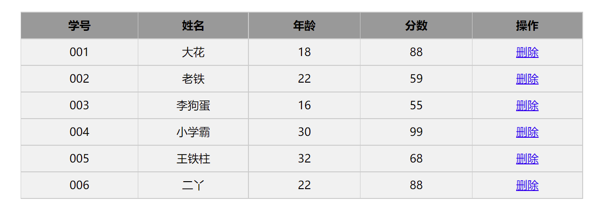

### 姓名	：张泳池

### 分数	：

---

PS. 该试卷部分题目来自题库，部分来自真实大厂笔试题，部分来自我们的课堂内容。

希望大家做选择和简答题部分时，不要把代码放在VSCode或浏览器上运行得出答案，全靠自觉哈~ 考试分数不重要，重点是掌握知识点，查漏补缺。


## 一、单选题（共30题，总分60分）

##### 1. 关于DOM中获取元素的方法，下列说法正确的是？   （ B ）

A: 	document.querySelector('.box') 是获取页面所有的元素

B: 	document.querySelector('.box') 是获取页面第一个类名为box的元素

C: 	document.querySelectorAll('.box') 是获取页面最后一个类名为box的元素

D: 	document.querySelector('.box') 是获取页面所有类名为box的元素


##### 2. 关于js中的事件，下列说法错误的是？ (  A )

A:	元素不能注册同名事件,比如给同一个按钮同时注册2个点击事件

B:	事件注册之后，比如点击，鼠标经过等事件，不会立即触发

C:	页面中DOM元素是都可以注册事件的

D:	事件既可以通过用户交互来触发，也可以使用代码主动触发,比如 btn.click()


##### 3. 关于innerText与innerHTML下列说法正确的是？ ( D )

A:	innerText与innerHTML作用完全一致，没有任何区别

B:	innerText属性里设置的标签可以被解析

C:	innerText获取内容的时候，如果内容中有HTML标签，标签会被正常解析

D:	innerHTML获取内容得到的是一个包含HTML标签的字符串


##### 4. 关于window对象，下列说法错误的是?    	（ D ）

A:	window对象是浏览器里的顶级对象

B:	window对象的属性和方法在调用时，可以省略window

C:	console.log(window.document === document) 这行代码会打印true

D:	window对象的onload事件会在页面DOM树加载完毕后立马执行


##### 5. 下列变量名合法的是  (	C   )

A: 	5show

B: 	return

C: 	$user

D: 	var


##### 6. parseInt("6*7", 10) 的 结果是（   C  ）

A: 	42

B: 	"42"

C: 	6

D: 	NaN


##### 7. 下面哪个选项可以产生 0 <= num <= 10 的随机数	 ( C )

A: 	Math.ceil (Math.randown() * 9 )

B: 	Math.floor (Math.random() * 10)

C: 	Math.floor (Math.random() * 11)

D:    Math.ceil (Math.random() * 11)


##### 8.  下列代码执行结果         			(   B	)

```js
function sum(a, b) {
  return a + b;
}
console.log(sum(1, "2"))
console.log(typeof sum(1, "2"))
```

A:	 3      string

B:	12	 string

C:	 3  	 number

D:	12 	number


##### 9.  请选出 3 所在 li 标签的颜色     	（   C	）

```html
<style>
  ul { color: blue !important; }    
  ul > li {  color: green; }				
  ul li + li { color: red;  }      
  li {  color: yellow;  }					
</style>
<ul>
  <li>1</li>
  <li>2</li>
  <li>3</li>
</ul>
```

A:	 蓝色

B: 	绿色

C:	 红色

D:	 黄色


##### 10. 下面代码的执行结果为（ D ）

```js
var a = 20;
function foo(){
   console.log(a) ; 
   var a = 10 ;
   ++a;
   console.log(a) ;
}
foo();
```

A: 	20 	10

B: 	10 	11

C: 	20 	11

D: 	undefined 	11


##### 11. 如下代码  , 此时box1和box2盒子的宽高分别为多少（ A）

A:	box1：`300*300`，box2：`200*200`

B:	box1：`200*200` ，box2：`300*300`

C:	box1：`200*200`，box2：`200*200`

D:	box1：`300*300`，box2：`300*300`

```css
<style>
html {
	font-size: 20px;
}

.box1 {
  width: 10em;
  height: 10em;
  background-color: pink;
  font-size: 30px;
}

.box2 {
  width: 10rem;
  height: 10rem;
  background-color: skyblue;
  font-size: 30px;
}
</style>

<div class="box1"></div>
<div class="box2"></div>
```

##### 12. 下列选项中能让元素往右平移400px并且同时实现放大2倍的代码是？（ B ）

A:	transform: translateY(400px) scale(2);

B:	transform: translateX(400px) scale(2);

C:	transform: translateX(400px);
			   transform: scale(2);

D:	transform: translateX(400px);
				transform: scaleX(2) scaleY(2);


##### 13. 关于offsetWidth属性，下列说法正确的是？  （ 	C   ）

A:	offsetWidth属性获取的是元素的width属性值

B:	offsetWidth属性获取的是元素的width + padding 属性值

C:	offsetWidth属性获取的是元素的width + padding + border属性值

D:	offsetWidth属性获取的是元素的width + padding + border + margin属性值


##### 14. 代码的输出结果是		（	C   ）

```js
function fnMax(a,b,c){
   var max = a > b ? a : b;
   if(c > max){ max = c;}
   alert(max);
}
fnMax(8, 2, 5);
```

A:	5

B:	2

C:	8

D:	10


##### 15. 下面代码输出什么  ？		(   C	 )

```js
var numbers = [1, 2, 3]
numbers[10] = 11
console.log(numbers)
```

A : 	[1, 2, 3, null x 7, 11]

B: 	 [1, 2, 3, 11]

C:	  [1, 2, 3, empty x 7, 11]

D:      SyntaxError


##### 16. 下面代码输出什么？(  C  )

```js
function addToList(item, list) {
  return list.push(item)
}
var result = addToList('apple', ['banana'])
console.log(result)
```

A:	['banana', 'apple']

B:   ['apple', 'banana']

C:	2

D:   true


##### 17. 事件传播的三个阶段是什么 ？(  D  )

A:	目标 -->  捕获  -->  冒泡

B:	冒泡  --> 目标 -->   捕获

C:    目标  --> 冒泡  -->  捕获

D:    捕获  --> 目标  -->  冒泡


##### 18. 下列哪种数组的方法不会修改数组本身 ？(  A  )

A:	slice

B:	splice

C:	sort

C:	unshift


##### 19. 关于JS中数据类型转换, 下列说法正确的是?( A )

A:	    console.log(true + 1)                 会在控制台打印2

B:	    console.log(undefined + null)  在控制台打印 0

C：	  console.log( 1+ "1")                  在控制台打印 2

D:		console.log(parseInt('12px'))  在控制台打印 12px


##### 20. 请问下列结构中，I'am here 字体会是多大？(  D  )

```html
<style type="text/css">
  #a {font-size:12px}   
  div p{ font-size:13px }  
  div .c{ font-size:14px }  
  .a .b .c{ font-size:15px } 
  #b{ font-size:16px }  
</style>

<body>
  <div id="a" class="a">
    <div id="b" class="b">
      <p id="c" class="c">I’am here</p>  
    </div>
  </div>
</body>
```

A:		12px

B:		13px

C:		14px

D:		15px

E:		 16px


##### 21.  关于对象遍历中， for(let k in obj) {} 下面说法错误的是？(  B  )

A :   k 可以遍历得到对象obj的属性名

B:   obj.k 也可以遍历得到对象obj的属性名

C:  obj[k] 可以得到对象obj的属性值

D:  for in 语法一般不用于遍历数组，主要用于遍历对象


##### 22.  下列选项关于事件委托说法错误的是？(  B  )

A:  事件委托可以解决事件绑定的那个程序过多的问题

B: 事件委托利用了事件捕获原理

C: 事件委托可以提高代码性能

D: 事件委托可以应用在click, mousemove等事件中


##### 23. 下面代码的输出是什么？（ D  ）

```js
function sayHi() {
    console.log(name);
    console.log(age);
    var name = "TJH";
    let age = 24;
}
sayHi()
```

- A: TJH 和 undefined
- B: TJH 和 ReferenceError
- C: ReferenceError 和 24
- D: undefined 和 ReferenceError

##### 24. 下面代码输出是什么？( C )

```js
let a = 666;
let b = new Number(666);
let c = 666;
console.log(a == b);
console.log(a === b);
console.log(b === c);
```

- A: true false true
- B: false false true
- C: true false false
- D: false true true

##### 25. 下面代码输出什么( C  )

```js
let obj1 = {
    name: 'obj1_name',
    print: function () {
        return () => console.log(this.name);
    }
}
let obj2 = { name: 'obj2_name' };
obj1.print()();
obj1.print().call(obj2);
obj1.print.call(obj2)();
```

A:  obj1_name    obj2_name      obj2_name

B:  obj2_name    obj1_name      obj2_name

C:  obj1_name     obj1_name      obj2_name

D:  obj2_name     obj2_name      obj1_name


##### 26. 下面代码输出什么?(  c  )

```js
for (var i = 0; i < 3; i++) {
    setTimeout(function () {
        console.log(i);
    }, 1);
}
for (let i = 0; i < 3; i++) {
    setTimeout(function () {
        console.log(i);
    }, 1);
}
```

A:  0 1 2             0 1 2

B:  0 1 2             3 3 3

C:  3 3 3             0 1 2

C:  3 3 3             3 3 3

##### 27. 下面代码输出是什么?( B )

```js
const shape = {
  radius: 10,
  diameter() {
    return this.radius * 2;
  },
  perimeter: () => 2 * Math.PI * this.radius
};

shape.diameter();
shape.perimeter();
```

A: `20` and `62.83185307179586`

B: `20` and `NaN`

C: `20` and `63`

D: `NaN` and `63`


##### 28. 下面代码输出什么？(  A )

```js
let c = { greeting: "Hey!" };
let d = c;
c.greeting = "Hello";
console.log(d.greeting);
```

- A: `Hello`
- B: `undefined`
- C: `ReferenceError`
- D: `TypeError`

##### 29. 下面代码输出?( B )

```js
console.log(typeof typeof 1);
```

- A: `"number"`
- B: `"string"`
- C: `"object"`
- D: `"undefined"`

##### 30. cool_secret可以访问多长时间?(  B  )

```js
sessionStorage.setItem("cool_secret", 123);
```

- A：永远，数据不会丢失。
- B：用户关闭选项卡时。
- C：当用户关闭整个浏览器时，不仅是选项卡。
- D：用户关闭计算机时。

---


## 二、 简答题  （共10题，总分50分）

##### 1. 下面的代码打印什么内容 （4分）

```js
var a = 10
;(function(){
  console.log(a)   
  var a = 5
  console.log(window.a)  
  console.log(this.a)    
  a = 20
  console.log(a)        
})()


undefined 10 10 20
```

##### 2. 下列程序的输出结果是什么？（6分）

```js
var x = 1
var obj = {
  x: 3,
  fun: function(){
    var x = 5
    return this.x
  }
}
var fun = obj.fun
console.log(obj.fun(), fun()) 

3 1
```

```js
var name='kaivon';
var object={
    name:'chen',
    getNameFunc:function () {
        var that = this;
        return function () {
            return that.name;
        }
    }
}
console.log(object.getNameFunc()())

chen
```


##### 3. 说一说事件委托的原理 ？（4分）

```js
利用事件冒泡
给父元素注册事件，触发子元素时，冒泡到父元素上，来触发父元素事件
```


##### 4. sessionStorage 和 localStorage的区别？（4分）

```js
生命周期不同，sessionStorage 生命周期为关闭浏览器窗口，在同一域名下，同一个窗口数据可以共享 ，localStorage的生命周期是永久的，可以多窗口，同一浏览器共享
```


##### 5. 水平垂直居中的方式？（4分）

```js
position 定位
margin : auto;
display:table-cell 
display：flex;
计算父盒子与子盒子之间的距离
```


##### 6. 通过构造函数new一个新对象（实例化），经过了哪些步骤 ？ （4分）

```js
1. 在构造函数里创建一个空对象
2. 将this指向这个空对象
3. 执行构造函数里面的代码, 给这个空对象添加属性和方法
4. 返回这个对象
```


##### 7. call apply bind 区别 ？（4分）

```js
都是改变this指向
1. call 接收参数列表 apply接收数组
2. call/apply 立即执行.  bind返回函数, 手动调用执行
```


##### 8.  基本数据类型有哪些？检测数据类型的方式？（5分）

```js
基本数据类型:
Number , null , String , Symbol , BigInt , undefined , Boolean
检测数据类型的方式:
typeof()
instanceof()
Object.protptype.toString.call()
```


##### 9.  说一说你对原型链的理解 （5分）

```js
对象通过 __proto__ 属性能访问到它的原型对象，且原型对象也有它自己的原型对象
当访问一个对象的属性或方法时，会先从自身找
如果自身没有，才会沿着 __proto__ 这条链向上寻找，直到找到最顶层的 Object.prototype 为止
```


##### 10.  什么是深拷贝， 什么是浅拷贝 ？实现浅拷贝有哪些方式， 实现深拷贝有哪些方式？ （10分）

```js
深拷贝：把一个对象里的属性和方法都拷贝过来（包括属性值和方法里的地址和值）
深拷贝方法： 
1. JSON.parse(JSON.stringify())  
2. 手写递归
3. lodash库
浅拷贝：只拷贝第一层的属性值和方法
浅拷贝方法：
1.Object.assign() 
2.扩展运算符 Spread const a = {...c} 
3.Array.prototype.concat() 
4.Array.prototype.slice() 
```


---


## 三、 代码题 （共40分 + 10）

##### 1. 冒泡排序   （8分）

```js
const arr = [1, 5, 6, 9, 2]
// 外层for循环 : 控制排序的轮数 arr.length - 1
// 内层for循环: 控制每一轮比较的次数  arr.length - 1 - i
// 每次排一轮, 就会固定一个最大值冒泡到最后, 所以内层有 - i ; 
// 注意 是 < , 不是 <= ; 

for (let i = 0; i < arr.length - 1; i++) {
  for (let j = 0; j < arr.length -1 -i; j++){
    if (arr[j] > arr[j+1]){
      [arr[j], arr[j+1]] = [arr[j+1], arr[j]]
    }
  }
}
console.log(arr)

// 2. arr.sort((a,b) => a - b)
```


##### 2. 编写一个方法去掉数组里面重复的内容  const arr = [1, 2, 3, 4, 5, 1, 2, 3]  (8分)

```js
// 1. indexOf + for
const arr = [1, 2, 3, 4, 5, 1, 2, 3] 
const newArr = [] 
for (let i = 0; i < arr.length; i++){
    // 遍历旧数组, 看里面的元素是否在新数组中存在, 如果不存在,就往里面push
    // 存在,就不放进去
    if (newArr.indexOf(arr[i]) === -1){
        newArr.push(arr[i])
    }
}
console.log(newArr)

// 2. includes + for 
const newArr2 = []
for (let i = 0; i < arr.length; i++){
    if (!newArr2.includes(arr[i])){
        newArr2.push(arr[i])
    }
}
console.log(newArr2)
// 3. 使用 ES6的一些新特性  Set
// ES6 提供了新的数据结构 Set。它类似于数组，但是成员的值都是唯一的，没有重复的值。
[...new Set(array)]  // Set S大写， Set本身是一个构造函数，用来生成 Set 数据结构
// 数组的[...]扩展运算符转为真正的数组
[...new Set(array)]

// 4. 
Array.from(new Set(arr)) : // Array.from() 可以将伪数组或可迭代对象转换为数组

let set = new Set([1, 2, 3, 4, 4]);
console.log(set)
Set(4) {1, 2, 3, 4}
```


##### 3. 实现表格的全选和反选功能   （12分）

需求：

1. 点击上面全选复选框，下面所有的复选框都选中（全选）
2. 再次点击全选复选框，下面所有的复选框都不中选（取消全选）
3. 如果下面复选框全部选中，上面全选按钮就自动选中
4. 如果下面复选框有一个没有选中，上面全选按钮就不选中


```js
const checkAll = document.querySelector('#j_cbAll')
const cks = document.querySelectorAll('#j_tb input')
checkAll.addEventListener('click', function(){
    for (let i = 0; i < cks.length; i++) {
        cks[i].checked = this.checked
    }
})

//  反选
for (let i = 0; i < cks.length; i++) {
    // 给每一个小复选框, 绑定点击事件
    cks[i].addEventListener('click', function(){
        const checkedCks = document.querySelectorAll('#j_tb input:checked')
        checkAll.checked = checkedCks.length === cks.length
    })
}


// 方式二
// 1. 获取元素 
const checkAll = document.querySelector('#j_cbAll')
// 全选，取消全选
const cks = document.querySelectorAll('#j_tb input')
checkAll.addEventListener('click', function(){
  for (var i = 0; i < cks.length; i++) {
    cks[i].checked = this.checked
  }
})
// 反选
const tbody = document.querySelector('#j_tb')
tbody.addEventListener('click', function(e){
  	if(e.target.nodeName !== 'INPUT') return 
    let arr = []
    for (let i = 0; i < cks.length; i++) {
      arr.push(cks[i].checked)
    }
    console.log(arr)
    if (arr.includes(false)) {
        checkAll.checked = false
    } else {
        checkAll.checked = true
    }
})
```


##### 4. 动态创建表格， 并实现删除功能   (12分)



```js
const tbody = document.querySelector('tbody')
const arr = data.map(({id,name,age,score}) => {
    return `
            <tr>
                <td>${id}</td>
                <td>${name}</td>
                <td>${age}</td>
                <td>${score}</td>
                <td><a class="del" href="javaspcrit:;">删除</a></td>
            </tr>
            `
})
tbody.innerHTML = arr.join('')

tbody.addEventListener('click', function(e){
    // 待操作的tr
    const opTr = e.target.parentNode.parentNode
    // e.target
    if (e.target.className =='del') {
        tbody.removeChild(opTr)
    }
})
```


##### 两数之和， 附加题（选做，可加分）10分

```js
给定一个整数数组 nums 和一个整数目标值 target，请你在该数组中找出和为目标值 target 的那两个整数，并返回它们的数组下标。

你可以假设每种输入只会对应一个答案。但是，数组中同一个元素在答案里不能重复出现。

你可以按任意顺序返回答案。

示例 1：
输入：nums = [2,7,11,15], target = 9
输出：[0,1]

解释：因为 nums[0] + nums[1] == 9 ，返回 [0, 1] 。

示例 2：
输入：nums = [3,2,4], target = 6
输出：[1,2]

示例 3：
输入：nums = [3,3], target = 6
输出：[0,1]

来源：力扣（LeetCode）
链接：https://leetcode.cn/problems/two-sum
```

```js
// 方法一
let twoSum = function(nums, target) {
  let len = nums.length;
  
  for (let i = 0; i < len - 1; i++) {
    for (let j = i + 1; j < len; j++) {
      if (nums[i] + nums[j] === target) {
        return [i, j]
      }
    }
  }
}
// 其他方法 --> leetCode  算法
```


