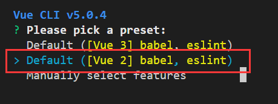
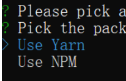
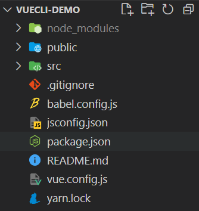
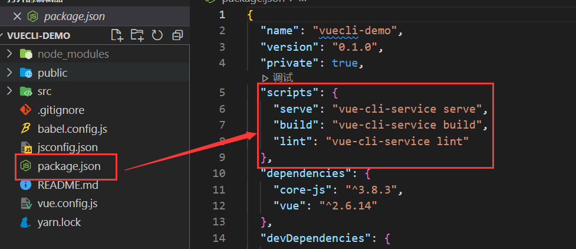

# Vue第二天


## 一、插件安装

### 1.1  浏览器扩展插件

#### 1.1.1 vue-devtools


### 1.2 vscode 插件

#### 1.2.1 vue文件代码高亮插件


#### 1.2.2 代码提示插件


## 二、了解Vue

### 1. 概念

特点：渐进式框架，逐渐使用，集成更多功能，逐渐进步，想用什么用什么。

Vue 是一套用于构建用户界面的渐进式框架，自底层向上应用，Vue的核心库只关注视图层，容易入门，可以和第三方库或者已有的项目进行整合，可以做复杂的单页应用。简单的说，vue是一套前端的开发框架，vue是目前三大主流的框架之一，其他两个框架是:React、Angular。vue的底层是原生js

例如：

```js
// 原生JS

<ul id="myUl"></ul>
<script>
    let arr = ["春天", "夏天", "秋天", "冬天"];
    let myUl = document.getElementById("myUl");
    for (let i = 0; i < arr.length; i++) {
        let theLi = document.createElement("li");
        theLi.innerHTML = arr[i];
        myUl.appendChild(theLi);
    }
</script>
```

```vue
// Vue
<li v-for="item in arr">{{item}}</li>
<script>
    new Vue({
        // ...
        data: {
            arr: ["春天", "夏天", "秋天", "冬天"] 
        }
    })
</script>
```

### 2. 库和框架

- 库:  封装的属性或方法 (例jquery.js)
  - 库是将代码集合成的一个产品，供程序员调用。
    		面向对象的代码组织形式而成的库也叫类库。面向过程的代码组织形式而成的库叫函数库。在函数库中的可直接使用的函数叫库函数。
- 框架: 拥有自己的规则和元素, 比库强大的多 (例vue.js)
  - 框架则是为解决一个(一类)问题而开发的产品。
    框架用户一般只需要使用框架提供的类或函数，即可实现全部功能。


## 三、 @vue/cli脚手架

### 1.概念

@vue/cli是Vue官方提供的一个全局模块包(得到vue命令), 此包为了保证各施工过程顺利进行而搭设的工作平台

优势：

- 开箱即用

- 0配置webpack
  - babel支持
  - css, less支持
  - 开发服务器支持

### 2.使用脚手架原因：

webpack自己配置环境很麻烦, 每下载一个包需逐个配置

### 3.安装与使用

#### 3.1 全局安装命令

```bash
npm install -g @vue/cli
```

注意: 如果半天没动静(95%都是网速问题), 可以`ctrl c `终止

#### 3.2 查看vue脚手架版本

```bash
vue -V
```

**如果出现版本号就安装成功, 否则失败**

#### 3.3 创建项目服务

```bash
# vue和create是命令, vuecli-demo是文件夹名
vue create vuecli-demo
# 错误提示：Parsing error: No Babel config file detected for 。。
```

```json
// 错误提示：Parsing error: No Babel config file detected for 。。

// 解决方法：

// 在package.json文件下找到"parserOptions"，添加："requireConfigFile" : false即可

// 如下：

"parserOptions": {

      "parser": "@babel/eslint-parser",

      "requireConfigFile" : false

    },
```


**选择模板**



**选择用什么方式下载脚手架项目需要的依赖包**



**回车等待生成项目文件夹+文件+下载必须的第三方包们**



**进入脚手架项目下, 启动内置的热更新本地服务器**



#### 3.4 启动

```bash
npm run serve
```


### 4.@vue/cli 目录和代码分析


```bash
vuecil-demo        # 项目目录
    ├── node_modules # 项目依赖的第三方包
    ├── public       # 静态文件目录
      ├── favicon.ico# 浏览器小图标
      └── index.html # 单页面的html文件(网页浏览的是它)
    ├── src          # 业务文件夹
      ├── assets     # 静态资源
        └── logo.png # vue的logo图片
      ├── components # 组件目录
        └── HelloWorld.vue # 欢迎页面vue代码文件 
      ├── App.vue    # 整个应用的根组件 所有网页上想要展示的页面（components 文件夹里）都必须和根组件有联系
      └── main.js    # 入口js文件	需要与根组件产生联系（固定写法，不能修改）
    ├── .gitignore   # git提交忽略配置
    ├── babel.config.js  # babel配置
    ├── package.json  # 依赖包列表
    ├── README.md    # 项目说明
		└── yarn.lock    # 项目包版本锁定和缓存地址
```

**主要文件及含义**

```js
node_modules下都是下载的第三方包 可以通过npm install下载，一般不会做为拷贝对象
public/index.html – 浏览器运行的网页
src/main.js – webpack打包的入口文件
src/App.vue – vue项目入口页面
package.json – 依赖包列表文件
```

### 5.@vue/cli 项目架构

#### 5.1 项目入口 - main.js


```js
// 项目js入口文件 - webpack打包就是从这里开始的
import Vue from 'vue' // 引入vue的源码
import App from './App.vue' // 引入项目根组件

Vue.config.productionTip = false // 一个控制台的打印提示 （不需要关注。只需要保留该行代码即可）
// let a = 'a'
// 是不是语法错误？？ 不是
// 是代码不符合规范，既然创建了变量，就应该去使用它，如果不使用则会白白的浪费内存
// 规避规范监测的方法呢？
/* 
  笔记！！！
  1. 全局取消eslint监测 => vue.config.js 中设置属性lintOnSave: false
  2. 局部屏蔽eslint监测
    2.1 对下一行代码进行屏蔽 => // eslint-disable-next-line
    2.2 对当前行代码进行屏蔽 => // eslint-disable-line
    2.3 多行代码都需要屏蔽时
      2.3.1 关闭监测 eslint-disable
      2.3.2 开启监测 eslint-enable
*/

/* 
  问题：为什么要将做好的一个干净的项目压缩后反复使用？除了使用代码创建比较耗时外还有什么理由呢？
  答：在实际的工作中，往往一个洁净的项目结构中有非常多使用基本脚手架创建出来的项目不具有的部分，为了保证每次使用时的这些不具有的配置能够保持一致（例如有10个项目，希望在初始化阶段保证完全一致）
  实际场景：在公司如果有一个全新的项目需要各位开发，那么公司中的架构师他会提供给各位一套完整的项目结构，我们只需要解压后，通过npm i安装这个项目所记录的依赖项即可使用
*/

new Vue({ // 实例化Vue对象（传入配置对象）
  render: h => h(App), // render渲染： 告诉vue需要渲染什么东西（渲染根组件）
}).$mount('#app') // 渲染到哪里 => 将根组件中的内容，替换index.html中id为app的标签

```

**来看看哪里有这个`#app`** - `public/index.html`


#### 5.2 main.js和App.vue以及index.html作用和关系

**作用：**

- main.js - 项目打包入口 - Vue初始化
- App.vue - Vue页面入口
- index.html - 浏览器运行的文件

**关系：**

- App.vue => main.js => index.html


### 6. @vue/cli 自定义配置

项目中没有`webpack.config.js`文件，因为@vue/cli用的`vue.config.js`

在package并列的处新建`vue.config.js`


```js
// 等同于webpack.config.js
// 每当修改完配置项后，需要重启项目才可生效
// 在实际开发过程中，很有可能会频繁的开启和关闭开发服务器 
// => 我们不希望每次开启的时候都会给我们一个新的网页，所以一般情况下会把自动开启浏览器的功能给关闭掉
const { defineConfig } = require('@vue/cli-service')
module.exports = defineConfig({
  transpileDependencies: true,
  devServer: { // 自定义服务配置
    port: 3000, // 自定义端口号
    // open: true, // 当开启开发服务器时自动打开浏览器
    // host: 'localhost',
    // https: false,
    // hot: false,
    // proxy: null
  },
  // lintOnSave: false
})
```

### 7.eslint

#### 7.1 介绍

- `eslint` 本身是一个语法规范检查的包。
- ESLint有两个工具，一个是模块包，一个是VSCode的扩展工具。

#### 7.2 为什么要用`ESLint` ?

- 统一团队编码规范(命名，众多格式等)
- 统一语法，毕竟es版本已经不少了(var/let....)
- 减少git不必要的提交(如果文件格式不一样，也会被git提交的)
- 避免低级错误
- 在编译时检查语法，而不是等JS引擎运行时才检查

**如：有一个只声明不使用的变量**


**解决方法：**

1. **手动解决掉错误, 以后项目中会讲如何自动解决**

2. **暂时关闭eslint检查(因为现在主要精力在学习Vue语法上), 在vue.config.js中配置后重启服务**

   

#### 7.3 eslint监测

```js
/* 
  笔记！！！
  1. 全局取消eslint监测 => vue.config.js 中设置属性lintOnSave: false
  2. 局部屏蔽eslint监测
    2.1 对下一行代码进行屏蔽 => // eslint-disable-next-line
    2.2 对当前行代码进行屏蔽 => // eslint-disable-line
    2.3 多行代码都需要屏蔽时
      2.3.1 关闭监测 eslint-disable
      2.3.2 开启监测 eslint-enable
*/
```


### 8. @vue/cli 单vue文件讲解 初始化项目清理

**单vue文件好处, 独立作用域互不影响**

- Vue推荐采用.vue文件来开发项目
- template里只能有一个根标签
- vue文件-独立模块-作用域互不影响
- style配合scoped属性, 保证样式只针对当前template内标签生效
- vue文件配合webpack, 把他们打包起来插入到index.html

**初始化项目清理无需初始化脚手架是带来的页面**

* src/App.vue默认有很多内容, 可以全部删除留下框

```vue
<template>
  <!-- 页面的标签结构，可以类比于html -->
  <!-- 在template标签中只能有一个根标签（div） -->
  <div id="app">
    <Demo></Demo>
  </div>
</template>

<script>
// js相关的代码
// 引用组件要遵循的3个步骤
/* 
  1. 通过import  ‘引入’ 组件,并为组件起一个自定义名称
  2. 通过components属性进行组件的 ‘注册’
  3. 在template标签内，以标签的形式继续 ‘使用’
*/
import Demo from './components/04-事件绑定的修饰符.vue'
export default { // 初始化项目清理 
  name: 'App',
  components: {
    Demo
  }
}
</script>

<style scoped>
  /* 设置组件样式 => css */
  /* 一般情况下回去设置一个属性 scoped， 这个属性的目的是让这个文件中的样式只作用域这个文件 */
</style>

```

### 9. 总结

- @vue/cli的本质是一个脚手架 =》 初始化一个基本的项目结构
- 通过`vue create 项目名称`创建脚手架， 通过`npm run serve`启动 =》 会得到一个开发服务器地址
- 脚手架的优势是不需要配置webpack直接可以使用 => 这种现象就类似于 axios是基于ajax封装得来的
- 脚手架项目打包的入口是`main.js`所有和项目有联系的代码都需要和它有联系
- 浏览器真正运行的html是`public/index.html` =》 通过`$tmount方法`将app.vue根组件中的结构与html中的某一个div所进行了替换
- 单`vue`文件拥有独立的作用域，不会影响其他文件 =》 style样式表会影响其他的文件，所以我们需要给所有用到style标签设置scoped属性

## 四、Vue运用

### 1. 插值表达式

**利用 { {}} 包裹着组件类属性名，且支持JavaScript运算**

语法：

```vue
<h1></h1>
1. 获取dom元素
2. 给该dom元素设置innerHTML / innerText

<h1>{{ 表达式( > < >= == === ! && || 三目运算 变量 ) }}</h1>
```

**注意：**

1. dom中插值表达式赋值
2. vue的变量必须在data里声明

Ex:

```vue
<template>
  <!-- 1. 通过 <vue 来快捷部署页面构建 -->
  <div>
    <!-- 通过双花括号的形式来构架插值表达式 -->
    <!-- <h1>{{ 表达式( > < >= == === ! && || 三目运算 变量 ) }}</h1> -->
    <!-- 原本应该在js代码中所进行的运输或者是变量的获取，现在都可以在这个花括号中执行了，减少了dom的操作
    简单来说，就是在标签里面写js代码 -->
    <!-- 
      差值表达式 就是替换了 webapi dom操作中的innerText
     -->
    <div>{{ 1 + 1 }}</div>		<!--2 -->
    <div>{{ 1 === 2 }}</div>	<!-- false -->
    <div>{{ msg }}</div>		<!-- 插值表达式 -->
    <div>{{ obj.name }}</div>	<!-- 张三 -->
    <div>{{ obj.age >= 18 ? '成年' : '未成年' }}</div>	 <!-- 未成年 -->
  </div>
</template>

<script>
export default {
  // 2. 给每一个vue文件起个名字 
  // (要求：组件的名称一般情况下是全英文且需要多个单词驼峰式命名)
  // 但是在初期学习阶段起名字还是比较困难的，我们可以随便写个单词+序号后面接一根短横线来表示名称 （例如： demo-01）
  // 为什么要这样做： eslint 代码规范要求我们需要设置多个单词组成词组的文件名称，而短横线可以屏蔽到这一判断
  name: 'demo-01',

  // 3. 一个vue文件中声明的变量需要放置在data函数的return对象上
  data () {
    return {
      msg: '插值表达式',
      obj: {
        name: '张三',
        age: 16
      }
    }
  }
}
</script>

<style>

</style>
```

### 2. MVVM设计模式

场景： 

​		当修改了data中的某个数据时， vue可以帮助我们在数据修改的同时，页面上的相应部分也会做出改变

设计模式:

​		 是一套被反复使用的、多数人知晓的、经过分类编目的、代码设计经验的总结。

+ MVVM，一种软件架构模式，决定了写代码的思想和层次
  + M：   model数据模型          (data里定义)	
  + V：    view视图                   （html页面）
  + VM： ViewModel视图模型  (vue.js源码)

- MVVM通过`数据双向绑定`让数据自动地双向同步  **不再需要操作DOM**
  - V（修改视图） -> M（数据自动同步）
  - M（修改数据） -> V（视图自动同步）


### 3.MVC设计模式

MVC允许在不改变视图的情况下改变视图对用户输入的响应方式，用户对View的操作交给了Controller处理，在Controller中响应View的事件调用Model的接口对数据进行操作，一旦Model发生变化便通知相关视图进行更新。

**原生HTML + JS 就是这样的**

​		将html看成view;js看成controller，负责处理用户与应用的交互，响应对view的操作（对事件的监听），调用Model对数据进行操作，完成model与view的同步（根据model的改变，通过选择器对view进行操作）;将js的ajax当做Model，也就是数据层，通过ajax从服务器获取数据。


### 4.vue的设计模式(面试题)

**简单描述一下vue的设计模式**

```
vue使用的mvvm设计模式。**MVVM**是`Model-View-ViewModel`缩写，也就是把`MVC`中的`Controller`演变成`ViewModel`。

`Model`层代表数据模型，`View`代表UI组件，`ViewModel`是`View`和`Model`层的桥梁，

数据会绑定到`viewModel`层并自动将数据渲染到页面中，视图变化的时候会通知`viewModel`层更新数据。（数据双向绑定）
```

### 5.v-bind - 动态属性

动态的绑定a元素的href属性、动态的绑定img元素的src属性；

**vue指令, 实质上就是特殊的 html 标签属性, 特点:  v- 开头**

每个指令, 都有独立的作用

- 语法：`v-bind:属性名="vue变量(data的return返回对象)"`
- 简写：`:属性名="vue变量"`

```vue
<template>
  <div>
    <!-- 动态属性 替换的是 webapi 中对dom属性的操作 -->
    <!-- 
    v-bind动态属性语法：
      v-bind:属性名="属性值"
      :属性名="属性值"
    -->
    <a v-bind:href="url">百度</a>
    <a :href="url">百度2</a>
    <!-- 
      关于动态属性的特例： 在使用动态属性渲染图片时，不可以直接将变量的值设置为路径
      原因： v-bind会把这个路径认为是字符串
      解决方案： 
        1. 通过 import 的方式引入图片并且赋值给data中的变量
        2. 通过 require 的方式引入图片并赋值给data中的变量

      以上两种解决方案，你觉得哪一个更好呢？？
      答： require 的引入方式更为友好。 当一个vue文件被使用时，那么既然是js代码，那么遵循从上往下依次执行，import中引入的图片就会在页面渲染初期被加载，而require引入的图片，只有在使用的时候才会被加载，初次开启页面会显得更加的高效
    -->
    <hr/>
    
    
    <hr/>
    
    <hr/>
    
  </div>
</template>

<script>
import image from '../assets/123.png'
export default {
  name: 'demo-02',
  data () {
    return {
      url: 'http://baidu.com',
      url2: '../assets/123.png',
      url3: image,
      url4: require('../assets/123.png')
    }
  }
}
</script>

<style>

</style>
```


### 6.vue项目代码优化(面试题)

```
问：vue项目如何做代码优化
答：
	以上问题中其中一点： 可以用require的方式引入图片，当使用到它的时候才会按需加载，而不会像import引入那样在页面创建时就会加载，加快页面初次加载效率
```

### 7.v-on  事件绑定

事件绑定指令，当用户需要点击，按下键盘，滚动鼠标等操作时，想要添加一些自己的逻辑处理时，就可以为特定的元素绑定一些特定的事件。

```
webapi
1. 获取dom元素
2. dom元素.onclick
3. dom元素.addEventListener

事件： click dblclick keydown keyup mouseover.....
```

**语法：**

* v-on:事件名="要执行的==少量代码==" **（尽量不要这么写）**
* v-on:事件名="methods中的函数"
* v-on:事件名="methods中的函数(实参)" 

**简写:**

-  @事件名="methods中的函数(实参)"

Ex:

```vue
<template>
  <div>
    <!-- v-on 绑定事件 替换的是 webapi 中的.onclick, .addEventListener -->
    <!-- 1. v-on绑定事件
      语法: v-on:事件名="少量代码"
      语法: v-on:事件名="methods里函数名"
      语法: v-on:事件名="methods里函数名(值)"
      语法: @事件名="methods里函数名"
    -->
    <div>当前数字： {{ count }}</div>

    <button v-on:click="count++">点击后count+1</button>
    <button v-on:click="addFn">点击后count+2</button>
    <button @click="addFn2(3)">点击后count+3</button>

  </div>
</template>

<script>
export default {
  name: 'demo-03',
  // data中放的页面上要用的变量
  data () {
    return {
      count: 1
    }
  },

  // methods 里定义的这个vue文件中所需要使用到的方法
  methods: {
    // 触发后count加2
    addFn (event) {
      // this 代表 export default {} 对象， data和methods里的属性都挂载在这个对象上
      this.count += 2
      console.log(event)
    },

    // 触发后count添加点击按钮传过来的实际参数
    addFn2 (num, event) {
      this.count += num
      console.log(event)
    },
  }
}
</script>

<style>

</style>
```

### 8.v-on  获取事件对象

获取v-on绑定事件的触发对象

语法:

* 无传参, 通过形参直接接收
* 传参, 通过`$event`指代事件对象传给事件处理函数

```vue
<template>
  <div>
    <!-- v-on 绑定事件 替换的是 webapi 中的.onclick, .addEventListener -->
    <!-- 1. v-on绑定事件
      语法: v-on:事件名="少量代码"
      语法: v-on:事件名="methods里函数名"
      语法: v-on:事件名="methods里函数名(值)"
      语法: @事件名="methods里函数名"
    -->
    <div>当前数字： {{ count }}</div>

    <button v-on:click="count++">点击后count+1</button>
    <button v-on:click="addFn">点击后count+2</button>
    <button @click="addFn2(3)">点击后count+3</button>

    <!-- 
      v-on获取事件对象 - event
        1. 无参数获取事件对象 - 我们的时间对象event默认在第一个形式参数上
        2. 有参数(特指带小括号的方法)，这个小括号会覆盖event默认参数，我们可以同$event的实际参数来代替这个事件对象

        注意事项：一般情况下，我们都将事件对象event 放到整个形式参数的最后一位
     -->
     <button v-on:click="addFn">点击后count+2（获取事件对象版本）</button>
    <button @click="addFn2(3, $event)">点击后count+3（获取事件对象版本）</button>
    <a href="http://baidu.com" @click="go">百度</a>
  </div>
</template>

<script>
export default {
  name: 'demo-03',
  // data中放的页面上要用的变量
  data () {
    return {
      count: 1
    }
  },

  // methods 里定义的这个vue文件中所需要使用到的方法
  methods: {
    // 触发后count加2
    addFn (event) {
      // this 代表 export default {} 对象， data和methods里的属性都挂载在这个对象上
      this.count += 2
      console.log(event)
    },

    // 触发后count添加点击按钮传过来的实际参数
    addFn2 (num, event) {
      this.count += num
      console.log(event)
    },

    // a标签的点击事件
    go (event) {
      event.preventDefault()
      console.log('阻止a标签的跳转')
    }
  }
}
</script>

<style>

</style>
```


### 9.v-on 修饰符

语法:

* v-on:事件名.修饰符="methods里函数"
  * .stop - 阻止事件冒泡
  * .prevent - 阻止默认行为
  * .once - 程序运行期间, 只触发一次事件处理函数

```vue
<template>
  <!-- 
    v-on:事件名.修饰符="methods里函数"

    * .stop - 阻止事件冒泡
    * .prevent - 阻止默认行为
    * .once - 程序运行期间, 只触发一次事件处理函数

    问题： 如果我把修饰符全忘了，影响我做开发吗？
    答：并不影响，因为修饰符只是在简化我们队事件对象的操作，并不影响事件对象本身

    问题： 修饰符与修饰符之间能不能混合使用？
    答： 可以混合使用，只需要在第一个修饰符后面通过点语法的形式链接后续修饰符即可

    事件修饰符的唯一作用： 简化代码而已
   -->
  <div @click="fatherFn">
    <p @click.stop="stopFn">点击后阻止冒泡</p>
    <a href="http://www.baidu.com" @click.prevent.stop>跳转百度</a>
    <p @click.once="clickCount">点击事件执行几次</p>
  </div>
</template>

<script>
export default {
  name: 'demo-04',
  data () {
    return {

    }
  },

  methods: {
    // 父标签的冒泡事件
    fatherFn () {
      console.log('冒泡事件触发')
    },

    // 阻止冒泡的方法
    stopFn () {
      console.log('子元素组件触发')
    },

    // 观察触发该方法的次数
    clickCount () {
      console.log('once触发')
    }
  }
}
</script>

<style>

</style>
```

